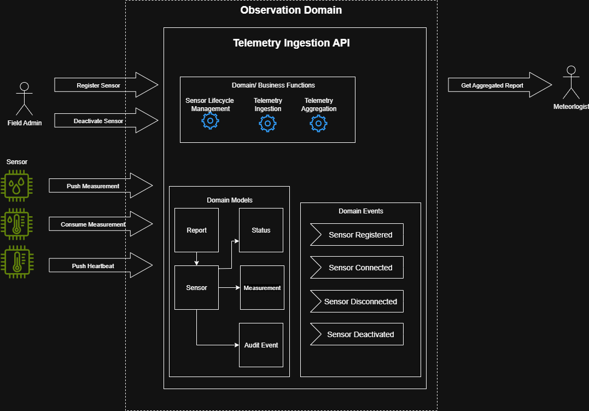
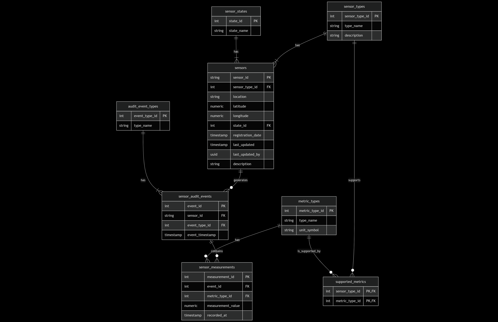
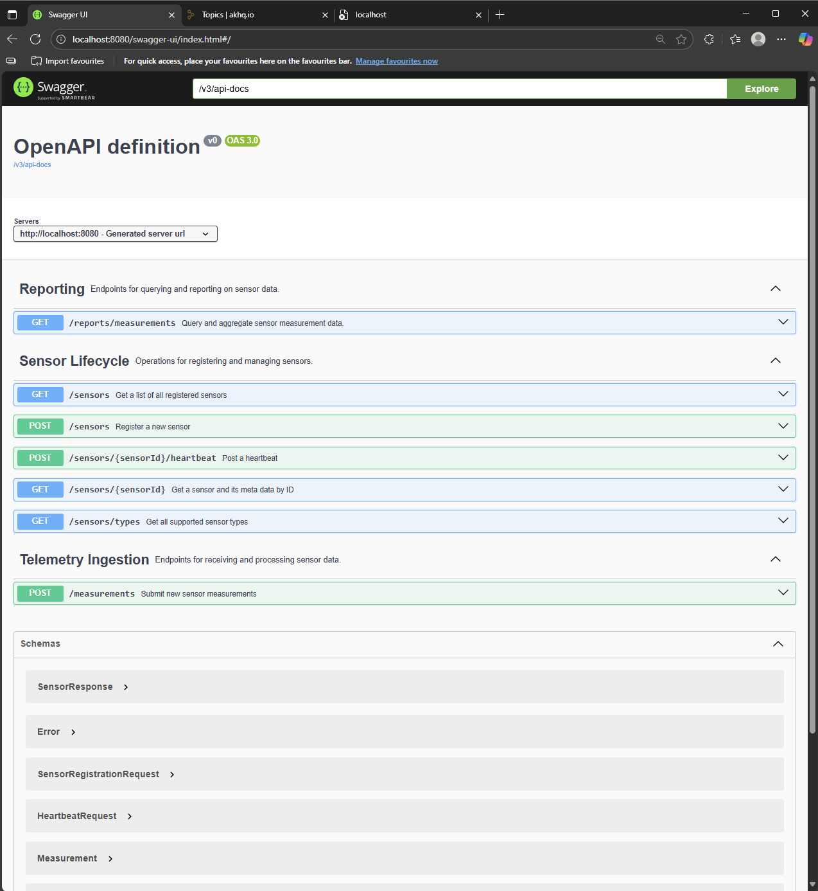
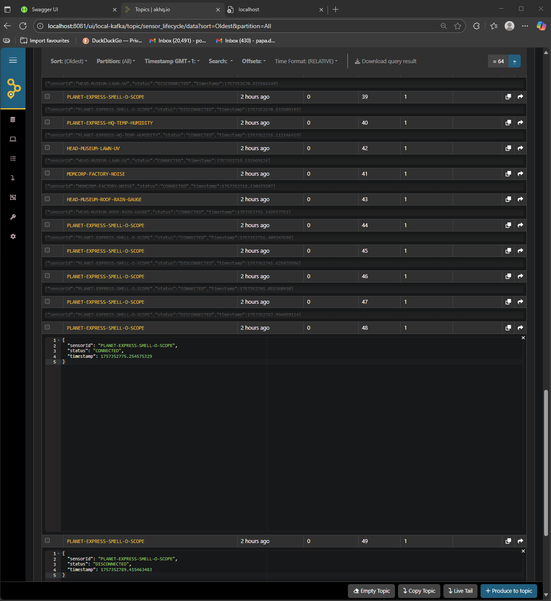
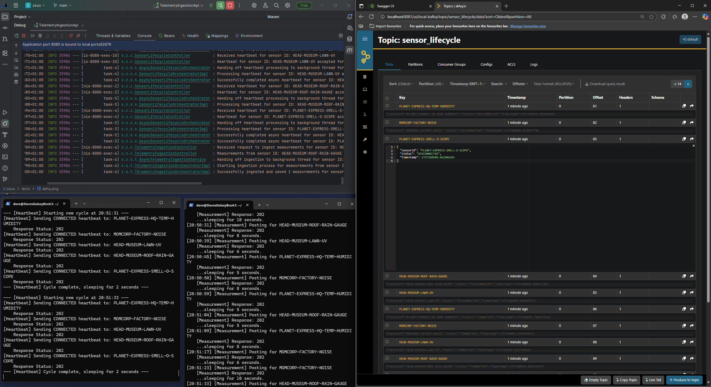

# Zeus Telemetry API

The God of the Sky (and weather sensors)


This readme provides an overview of the Zeus Telemetry API, a service for managing the lifecycle of weather sensors and ingesting and aggregating sensor telemetry data.

## Table of Contents

* [Overview](#overview)
* [Domain Model](#domain-model)
* [High Level System Diagram](#high-level-system-diagram)
* [Building The Project](#building-the-project)
* [Testing the Project](#testing-the-project)
* [Running the Project](#running-the-project)
* [Up Next](#up-next)

## Overview

### Zeus's Main Features and points of Interest

* **Contract-First Design:** The HTTP API is developed using a contract-first approach with the OpenAPI Specification, ensuring clear and consistent API design.
* **Asynchronous Processing:** Utilizes "fire-and-forget" endpoints for high-throughput telemetry ingestion and sensor heartbeats, providing faster responses to clients.
* **Automated Health Monitoring:** A centralized, background monitor automatically tracks sensor health, detecting disconnects and managing the sensor lifecycle.
* **Domain Event Publishing:** Publishes event-driven key sensor lifecycle events (e.g., REGISTERED, DISCONNECTED, CONNECTED) to a Kafka topic, enabling downstream consumers to react on key lifecycle events.
* **Configurable Caching:** Implements simple caching for aggregate reports to improve performance, with a configurable cache expiration.
* **Database Migrations:** Using off the shelf reliable database migration tools in this case Flyway
* The API is also designed to scale horizontally

## Domain Model



A domain driven approach was taken to design Zeus. Many assumptions have been made in the creation of the domain model. For example, it is assumed Zeus 
will will be a component in a larger domain such as the Observation Domain. Other components and services may exist in the Observation Domain such as Sensor Inventory Management,
and other Meteorlogical components. There may even be sub domains within the Observation Domain. Please draw your attention too:

- The Boundary of the API within the Domain
- Domain input use cases (left directional arrows)
- Domain/ Business Functions
- Domain Models/ Entities
- Domain Events
- Domain output use cases (right directional arrows)

### Entity Relationship



## High Level System Diagram


## Building The Project

- `git clone git@github.com:daveepope/zeus.git`
- `cd <directory>/zeus` <-- this is the repo root run all Maven  commands from here
- `mvn clean install `

## Running the Project

#### Setup Local Environment using Docker

There is a local `docker-compose.yml` preconfigured to setup all of Zeuz's dependencies. 
The compose will spin up Kafka, Postgres and execute db and kafka seeding scripts as well as adding some test data to get you started.
It will also spin up a Kafka client called AKHQ you can use for debugging. See simulator section below for a demonstration of how AKHQ can consume events from the service for debugging.

To start the docker-compose:

- `cd <your-local-directory>/zeus/src/main/resources`
- `docker-compose up -d`

To stop the docker environment:
- `cd <your-local-directory>/zeus/src/main/resources`
- `docker-compose down -v`

If you wish to query the db:
- ` docker exec -it postgres-db psql -U hubertjfarnsworth -d telemetrydb`
- `\dt` to list all entities
- then directly in the psql cmd line: `SELECT * FROM sensors;` 

#### Run using Maven
Navigate to the repo root and simply run the following mvn command
- `cd <your-local-directory>/zeus`
- `mvn spring-boot:run`

Once the application is running navigate in your browser too:

- http://localhost:8080/swagger-ui/index.html#/scx -> swagger
- http://localhost:8081/ -> akhq Kafka client 
<div align="center">
  
  
</div>
 
#### Run using Inteliji
Open Intellij then select the `pom.xml` in `<your-local-directory>/zeus` (repo root)

## Testing the Project
Navigate to the repo root and simply run the following mvn command
- `cd <your-local-directory>/zeus`
- `mvn clean test`

## Using the Endpoints

There are example Sensors in seed script when using the local docker environment. ut you can also register 
your own sensors and get sensor related info.

For more details on requests and responses please see the Swagger documentation.

### 1. POST Register a Sensor

#### Request
`'http://localhost:8080/sensors'`

```
{
  "sensorId": "PLANEX-HQ-TEMP-HUMIDITY",
  "sensorType": "TEMPERATURE_AND_HUMIDITY_SENSOR",
  "location": "Planet Express Building, New New York",
  "latitude": 40.7128,
  "longitude": -74.006,
  "description": "Monitors the main package hangar."
}
```

#### Response 
(note that each sensor has supported metrics (Temperature, Wind Direction) that the sensor can report telemetry measurements on)

```
200 OK
{
  "sensorId": "PLANEX-HQ-TEMP-HUMIDITY",
  "sensorType": "TEMPERATURE_AND_HUMIDITY_SENSOR",
  "location": "Planet Express Building, New New York",
  "latitude": 40.7128,
  "longitude": -74.006,
  "state": "DISCONNECTED",
  "registrationDate": "2025-09-08T20:54:12.949502+01:00",
  "description": "Monitors the main package hangar.",
  "supportedMetrics": [
    "TEMPERATURE",
    "HUMIDITY"
  ]
}
```

### 2. POST Measurement

#### Request
`'http://localhost:8080/measurements'`

```
{
  "sensorId": "PLANEX-HQ-TEMP-HUMIDITY",
  "eventTimestamp": "2025-09-07T17:21:00Z",
  "measurements": [
    {
      "metricType": "TEMPERATURE",
      "measurementValue": 25.5
    }
  ]
}
```

#### Response

```
202 ACCEPTED
```

### 1. GET Report

#### Request
`'http://localhost:8080/sensors'`

Example from swagger:


#### Response
(note that each sensor has supported metrics (Temperature, Wind Direction) that the sensor can report telemetry measurements on)

```
200 OK
{
  "results": [
    {
      "sensorId": "PLANEX-HQ-TEMP-HUMIDITY",
      "aggregatedMetrics": [
        {
          "metricType": "TEMPERATURE",
          "statistic": "average",
          "value": 25.5
        }
      ]
    }
  ],
  "queryTimestamp": "2025-09-08T20:02:23.903805749Z"
}
```

## Running the Simulators

Zeus some with 2 simulators. A heartbeat simulator and a telemetry simulator. 
- heartbeat simulator: POSTs heartbeat events via HTTP to the API at intervals. One of the sensors is configured to send heartbeats over a flaky network.
- telemetry simulator: POSTs sensor measurements events via HTTP to the API at intervals.

To start the simulators:

- Start the Telemetry API
- `cd <your-local-directory>/zeus/src/main/resources`
- then exec each script: `./heartbeat_simulator.sh` `./telemetry_simulator.sh`

To stop the simulators, simply just ctrl + c in the terminal.

Below is a screenshot showing the simulators (bottom left) running creating sensor heartbeats and sensor measurements at intervals. 
One the sensors is configured to be flaky, i.e. its CONNECTING and DISCONNECTING regularly, and you can see this being handled by the 
Telemetry API



## Future Enhancements
- observability and monitoring 
- Integration/ Component Tests - didn't get a chance to add these but would not be much effort and we can discuss this
- Event driven telemetry ingestion via Kafka or a more suitable messaging protocol such as MQTT, used primarily with small devices on flaky networks, such as weather sensors
